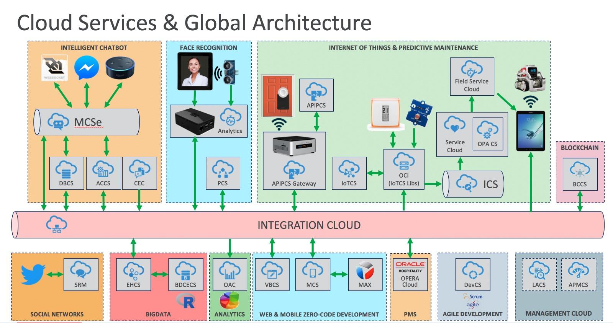

Looking for new business opportunities? Chatbots bring new ways to interact with customers using modern channels such as Messaging Apps, Voice Assistants and Connected Cars. This demo, powered by the new Oracle Bot technology and 20 other PaaS and SaaS Oracle Services, shows how we bring users a seamless traveler experience: from web-based booking, mobile checkin with face recognition and voice-driven room services request, to predictive maintenance based on IoT and BigData.

## Supporting Documentation

### Demo Video

Detailed video showing the end-to-end demo. A real, practical and comprehensive solution for the new revolution in the Travel and Tourism market. If you want to attract Millennials you will need to be where they are, on instant messaging platforms and improving the way of they are currently offering their services.



### Premiere / Marketing video

Video describing the solution created by WEDO team from a Marketing point of view.



