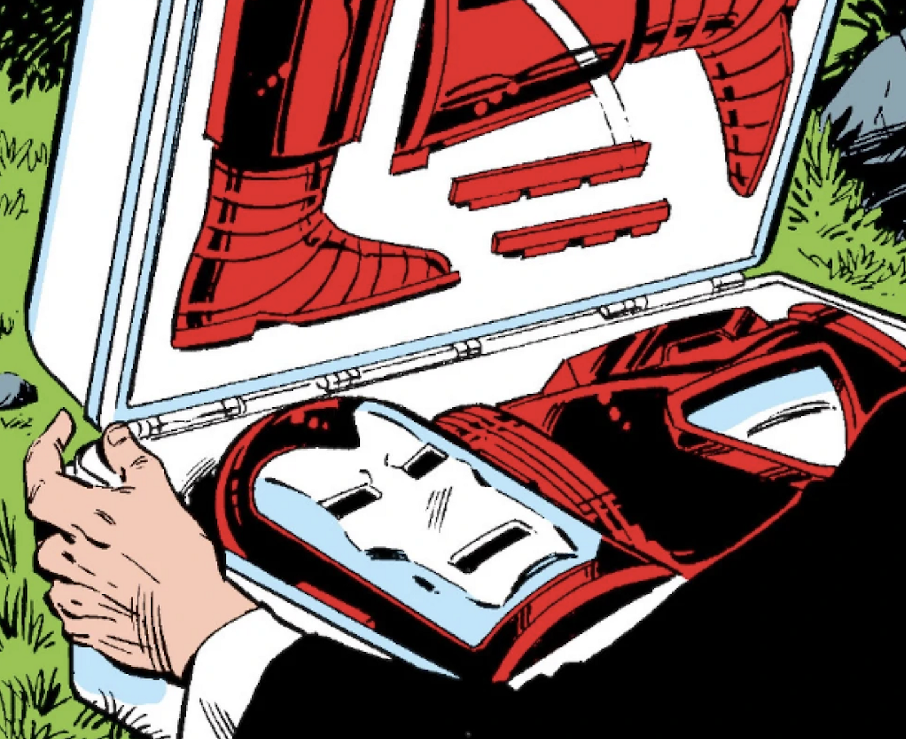

## The Briefcase Dream

I've always been a fan of Marvel superheroes comics, long before the successful movie franchise known as MCU. Actually, around 1972–1975, I could find several Marvel comics carefully translated and lettered in my native language by visiting my friendly (actually, he wasn't) news vendor, strategically placed in the market street corner few hundred yards from where I lived.

The hard limit — at the time — was the number of physical coins I was allowed to spend within a month without incurring into Mum's inevitable semi-verbal reproach.

Few years later, my tastes and interests turned to the Golden Age Sci-Fi (Asimov and all of the Futurians, Heinlein, Bradbury ). The news vendor corner was always there, my monthly allowance was a tad more generous and I could smuggle sci-fi books in my school bag without arousing suspicion. With a notable exception: pooled with the books, a comic, the Iron Man episode where the iconic Mr. Stark briefcase was introduced to my 'magnets and miracles' world.

I wish I had that briefcase available in a number of situations, getting a bad grade or running into the inevitable school bully: my curiosity about the relationship between miniaturization and technology remains a fixed point even today.

Then, decades later, the briefcase idea surfaced again while having fun with an iteration of the Oracle's [Proxima City](https://www.youtube.com/watch?v=aJUSEEagm8Q) model made by the Italian Innovation Team, a whimsical (as it's been called) construction made with Legos, Arduinos, sensors and Oracle Cloud Infrastructure services.

During the 2020 lockdown we had no access to the city model, installed in the Customer Visit Center in Rome. I was struggling to find a way to show a functioning demo either via Zoom or bringing some artifacts into customer premises (no Star Trek transporter available, so far), and urged to prepare something smaller than a city model but powerful enough to show the concept.

"I should definitely do it" was my inner morning echo while sipping my favorite daily americano brew. Changing the model to be portable also meant changing the use cases perimeter: the year 2020 required — for obvious reasons — a rapid transition from Smart City services to an extended and appropriate Safe City scenario.

Requirements were clear: small enough to fit in my backpack, programmable, made with off-the-shelf components, easily connectable to OCI services, and capable to show the end-to-end message flow by means of physical interaction. The stretch goal was to enable teachers, students, developer and tinkerers to improve this 'portable lab' and develop new use cases oriented to safety, exploring and expanding the needed back-end cloud services.

## From Briefcase to Cloud, and Back

Here's the link (Note: insert link) to the article series about what I call **ProximaSafe**, showing how to build some Cloud and Edge capabilities to make a testbed for safety-related applications (included, but not limited to) using a number of technologies and tools, such as:

- **Oracle Golden Gate Streaming Analytics**, to analyze data in motion and detect anomalies and/or errors
- **OCI Streaming**, the messaging backbone
- **OCI Functions**, the serverless infrastructure used to enable the upstream messages to Edge
- the **M5Stack** family of development boards, acting as Edge Components enabled to publish and subscribe to IoT topics
- a **Raspberry Pi 4**, the inevitable Edge gateway taking care of communication between sensors & boards to Cloud — and viceversa
- a suitable battery pack to power the whole stuff.

The overall architecture designed for this mobile lab includes the representation of the edge (the boards inside the briefcase) and the communication flow edge -> OCI -> edge with return messages containing anomaly detections and alarms.

So, given a number of messages that can be recognized as an uptrend/downtrend pattern or a number of messages within a time frame (maybe few seconds), the stream analysis within OCI may (or may not) throw an alarm, sent back to the edge to make something happen.

Here's a short YouTube video: https://youtu.be/dw_odrtwAUk.

**Three chapters, a common goal**

I've divided the whole path in chapters that will be published every fortnight or something, trying to avoid the 'War and Peace' syndrome (I'm not sure I achieved that). Here's the breakdown of the articles:

- In **chapter 1**, we'll set up OCI resources to implement an even-driven engine, capable of analyzing the stream of events (and data) from the edge
- In **chapter 2**, we'll set up the feedback mechanism to return alarms to the edge in order to make something happen locally
In the **final chapter** (three is the magic number), we'll select and program the edge components (thingies in our briefcase) and we'll design some pipelines in the cloud corresponding to a number of use cases.

It was fun to build it. The boy I used to be would be proud of it.

The briefcase needs more engineering. I became no Tony, no superpowers, no millionaire, and — overall — my once dark goatee has become white (alas!), so the distant reflection of that boy slipping comics and books in the backpack while wondering about future technology maybe it's gone forever. My morning back pain reminds me that, indeed, it is.

Well, here's the [link to the first chapter](/projects/wedo/proxima-chapter-1), for it is time to think about the next thing to write.

I still daydream about that magical briefcase, though.
